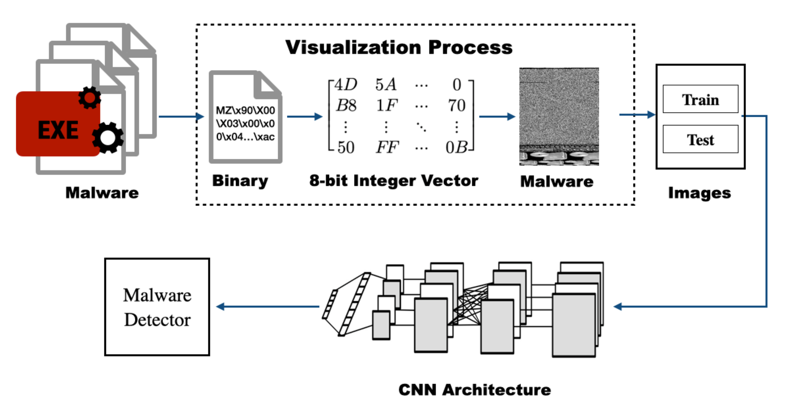

# MalPatch
> MalPatch: Evading DNN-Based Malware Detection With Adversarial Patches

# Background
We leverage the adversarial patch ([paper](https://arxiv.org/abs/1712.09665))— a special type of adversarial attack without knowing the sample being modified when constructing the attack. In particular, we propose a new adversarial attack for malware analysis called MalPatch. It locates the nonfunctional part of malware for adversarial patch injection to protect executability while generating adversarial patches based on different strategies. The generated patch can be injected into any malware sample, fooling the detector into classifying it as benign.

# Target Model
MalConv: Malware detection by eating a whole exe ([paper](https://arxiv.org/abs/1710.09435))

AvastNet: Deep convolutional malware classifiers can learn from raw executables and labels only

Grayscale detectors: These detectors transform PE files into grayscale images and detecting malware using a trained DNN detector. All four trained DNN models that we repurpose for this research study, namely LeNet, ResNet-50, DenseNet-121, and SqueezeNet-v1.

# Framework
The general framework of generating adversarial patches by MalPatch and performing universal adversarial attacks. In the attack preparation phase, (1) MalPatch replaces and appends a part of the bytes as the initialized patch, and then (2) optimizes the patch over a set of malware samples. (3) We use the optimized patch as the universal adversarial perturbation, and the patch can be directly applied in any malware to evade DNN-based detection, enabling universal query-free evasion attacks.

# Patch Injection
As reported by Anderson et al. ([paper](https://arxiv.org/abs/1801.08917)), possible and straightforward solutions to perform modifications include either changing bytes in part of the files that are not used or directly appending them at the end of the file. Therefore, we discuss two practical byte-level manipulations of Windows programs applied in this work, namely `Partial DOS` and `Padding`.

`Partial DOS` - The first component in the DOS header is IMAGE DOS HEADER (64 byte-long), which contains metadata for loading the executable inside a DOS environment. The only two irrevocable fields in the DOS header are the magic number MZ and the 4-byte-long integer at offset 0x3c as a pointer to the actual header. Nevertheless, the remaining bytes can be used by the attacker to inject the adversarial payload.

`Padding` - Data that is not indexed in the section table will not be mapped into memory and executed, i.e., un-mapped data. In particular, the chunk of unused bytes, like debug information, at the end of PE files are un-mapped data and include appended bytes by the adversary.

# Dataset
[Malware Detection PE-Based Analysis Using Deep Learning Algorithm Dataset](https://figshare.com/articles/dataset/Malware_Detection_PE-Based_Analysis_Using_Deep_Learning_Algorithm_Dataset/6635642) contains 8970 malware and 3140 benign binaries files. Malware files are divided into five families: Locker (300), Mediyes (1450), Winwebsec (4400), Zbot (2100), and Zeroaccess (690).

Pre-trained MalConv model [Pr-Malconv](https://github.com/pralab/secml_malware/blob/master/secml_malware/data/trained/pretrained_malconv.pth)

# Code
`MalPatch_binary` contains the code that attacks the MalConv&AvastNet.

`MalPatch_img` contains the code that attacks the Grayscale detectors.

In each Folder, there are two main attack.py file corresponding to white-box attack and black-box attack.

`API-validation` contains the functionality validation code as well as the API sequences and reports from [Cuckoo Sandbox](https://cuckoosandbox.org/).

**Note:** To run MalPatch_binary, you need to replace this file in library `../secml/adv/attacks/evasion/c_attack_evasion.py` with `c_attack_evasion.py` in the folder.

